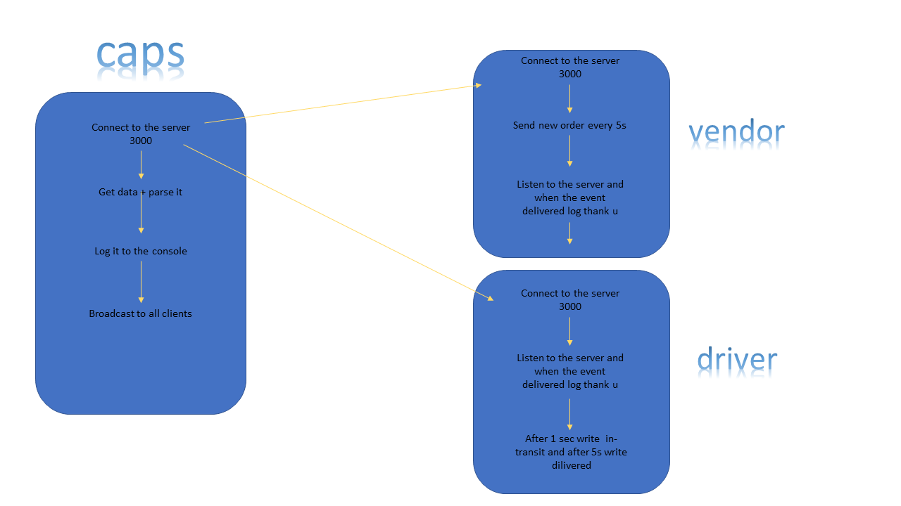

# LAB: caps

In Phase 2, we’ll be spreading the functionality of our CAPS application into multiple applications, so that users on different computers and connections can continue to communicate in real time as packages are prepared, picked up, and delivered.

The core functionality we’ve already built remains the same. The difference in this phase is that we’ll be using multiple applications to raise and listen for the events. The majority of the user stories remain unchanged, but there’s a difference in how we deal with the events.

### Author: Osama Mousa

### Links and Resources
- [submission PR class-16](https://github.com/401-advanced-javascript-osama/caps/pull/2)

### Modules
#### `Node.js` 
### Packages
#### `dotenv` , `faker` , `net`

#### How to initialize/run your application

- `node caps.js`
- `node vendor.js`
- `node driver.js`

#### Tests

#### UML

