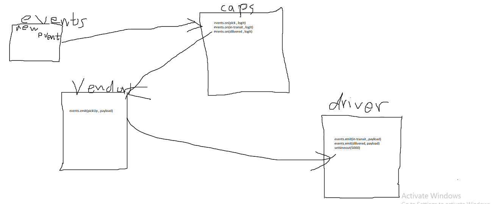

# LAB: caps

CAPS Phase 1: Begin the build of an application for a company called CAPS - The Code Academy Parcel Service. In this sprint, we’ll build out a system that emulates a real world supply chain. CAPS will simulate a delivery service where vendors (such a flower shops) will ship products using our delivery service and when our drivers deliver them, be notified that their customers received what they purchased.

### Author: Osama Mousa

### Links and Resources
- [submission PR class-16](https://github.com/401-advanced-javascript-osama/caps/pull/1)

### Modules
#### `Node.js` 
### Packages
#### `dotenv` , `faker` 

#### How to initialize/run your application

- `nodemon`

#### Tests

- Test: `node driver.js` 

#### UML

